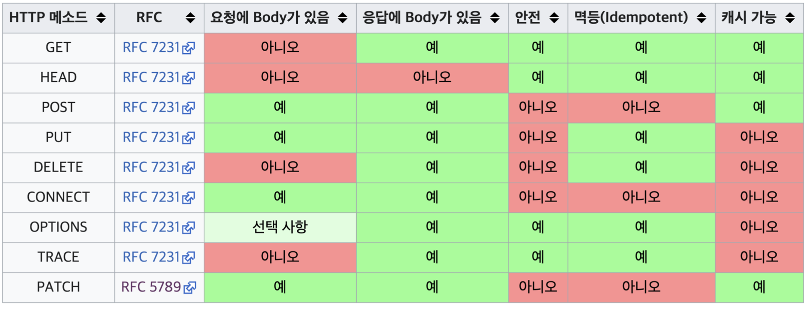

# HTTP 메서드

## API URI 설계

### 리소스와 행위를 분리

> 가장 중요한 것은 리소스를 식별하는 것

- **URI 는 리소스만 식별**

- **리소스**와 해당 리소르르 대상으로 하는 **행위**를 분리

  - 예시

    - 리소스 : 회원
    - 행위 : 조회, 등록, 삭제, 변경

    > 회원 조회 : /members/{id} 
    >
    > 회원 등록 : /members/{id}
    >
    > 회원 수정 : /members/{id}
    >
    > 회원 삭제 : /members/{id}

- 리소스는 명사, 행위는 동사

- 행위(메서드)는 어떻게 구분?

  - URI만 봐서는 어떤 행위인지 구분이 되지 않는다

## HTTP 메서드 종류

### 주요 메서드

- GET : 리소스 조회
- POST : 요청 데이터 처리, 주로 등록에 사용
- PUT : 리소스를 대체, 해당 리소스가 없으면 생성
- PATCH : 리소스 부분 변경
- DELETE : 리소스 삭제

### 기타 메서드

- HEAD : GET과 동일하지만 메시지 부분을 제외하고, 상태 줄과 헤더만 반환
- OPTIONS : 대상 리소스에 대한 통신 가능 옵션(메서드)을 설명(주로 CORS에서 사용)
- CONNECT : 대상 자원으로 식별되는 서버에 대한 터널을 상징
- TRACE : 대상 리소스에 대한 경로를 따라 메시지 루프백 테스트를 수행

### GET

- 리소스 조회
- 서버에 전달하고 싶은 데이터는 query(쿼리 파라미터, 쿼리 스트링)를 통해서 전달
- 메시지 바디를 사용해서 데이터를 전달할 수 있지만, 지원하지 않는 곳이 많아서 권장하지 않음

### POST

- 요청 데이터 처리
- **메시지 바디를 통해 서버로 요청 데이터 전달**
- 서버는 요청 데이터를 **처리**
  - 메시지 바디를 통해 들어온 데이터를 처리하는 모든 기능을 수행
- 주로 전달된 데이터로 신규 리소스 등록, 프로세스 처리에 사용

### PUT

- **리소스를 대체**
  - 리소스가 있으면 대체
  - 리소스가 없으면 생성
  - **쉽게 이야기해서 덮어버림**
- **중요! 클라이언트가 리소스를 식별**
  - 클라이언트가 리소스 위치를 알고 URI 지정
    - /members/100
  - POST와 차이점

### PATCH

- 리소스 부분 변경
- `PUT` 에서는 데이터의 일부만 수정이 불가능(완전히 덮어버림),
  `PATCH` 는 데이터의 일부부만 수정이 가능하다
- 일부 브라우저에서는 PATCH 사용이 불가능하다
  그럴땐 `POST` 를 사용하면 된다

### DELETE

- 리소스 제거

## HTTP 메서드의 속성

### 안전(Safe Methods)

- 호출해도 리소스를 변경하지 않는다

### 멱등(Idempotent Methods)

- 한번 호출하든 두번호출하든 100번 호출하든 결과가 똑같다
- 멱등 메서드
  - **GET** : 같은 결과과 조회횐다
  - **PUT** : 결과를 대체한다. 따라서 같은 요청을 여러번 해도 최종결과는 같다
  - **DELETE** : 결과를 삭제한다. 같은 요청을 여러번 해도 삭제된 결과는 똑같다
  - **POST** : **멱등이 아니다 !** 두번호출하면 같은 결제가 중복해서 발생할 수 있다

- 활용

  - 자동 복구 매커니즘

    - 예시) `DELETE` 로 삭제요청을 보냈는데 --> 응답이 없다 --> 재요청

      DELETE 메서드는 <u>멱등</u>하기때문에 여러번 호출이 가능

  - 서버가 TIMEOUT 등으로 정상 응답을 못주었을때, 클라이언트가 같은 요청을 다시 해도 되는가?에 대한 판단 근거

~~~
Q : 재요청 중간에 다른 곳에서 리소스를 변경해버리면?
- 사용자1 : GET -> username:A, age:20
- 사용자2 : PUT -> username:A, age:30
- 사용자1 : GET -> username:A, age:30 --> 사용자2의 영향으로 바뀐 데이터 조회

A : 멱등은 외부 요인으로 중간에 리소스가 변경되는 것 까지는 고려하지 않는다.
~~~

### ⭐️ 캐시 가능(Cacheable Methods) ⭐️

- 응답 결과 리소스를 캐시해서 사용해되 되는가?

  > 응답크기가 큰 요청을 하고 나서 재요청하게되면 부하가 발생 -> 줄이기 위해서 캐시사용
  >
  > 웹브라우저가 내부에 리소스를 저장할 수 있는가?

- GET, HEAD, POST, PATCH 캐시 가능

- 실제로는 GET, HEAD 정도만 캐시로 사용

  - POST, PATCH는 본문 내용까지 캐시 키로 고려해야 하는데, 구현이 쉽지 않음

