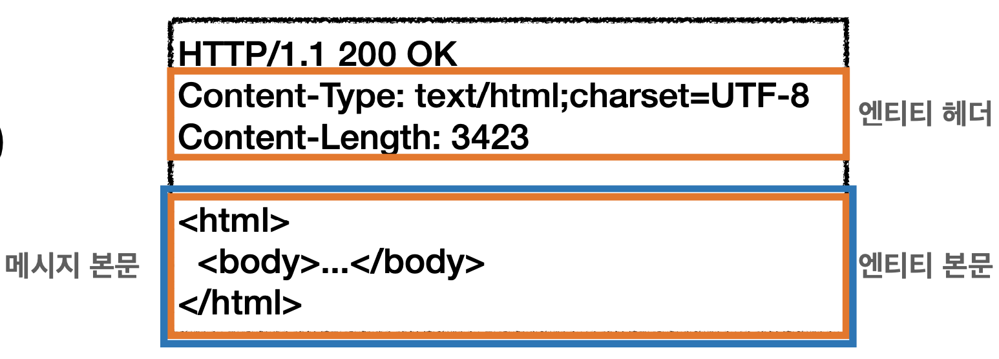
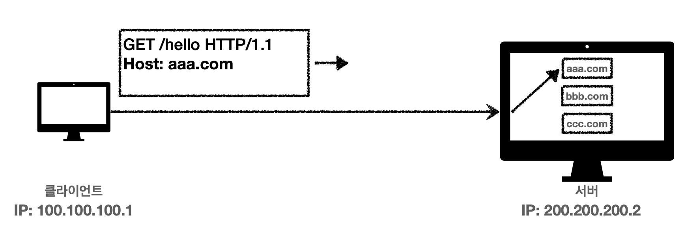
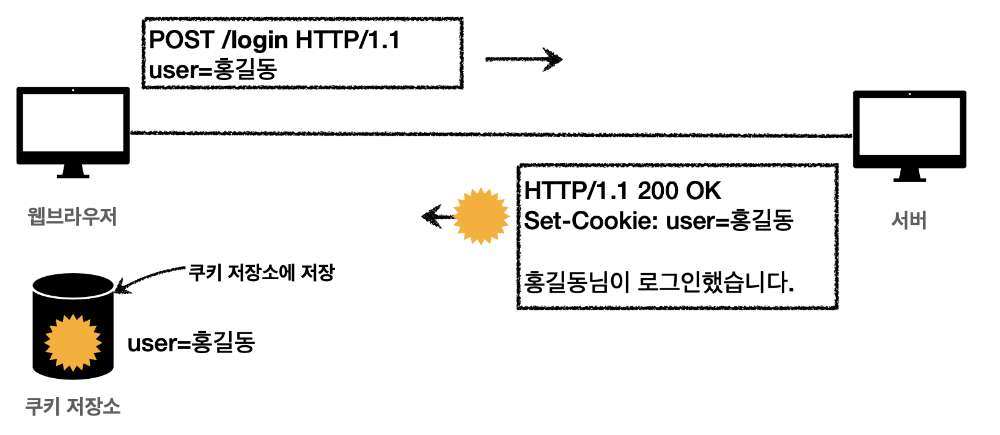

# 일반 헤더

## HTTP BODY

- 메세지 본문(message body)을 통해 표현 데이터 전달

- 메시지 본문 = 페이로드(payload)

- **표현**은 요청이나 응답에서 전달할 실제 데이터

- **표현 헤더는 표현 데이터**를 해석할 수 있는 정보 제공

  - 데이터 유형(html, json) 데이터 길이, 압축 정보 등등

  

## 표현

- Content-Type : 표현 데이터의 형식
  - 미디어 타입, 문자 인코딩
    - Text/html; charset=utf-8
    - application/json
    - Image/png
- Content-Encoding : 표현 데이터의 압축 방식
  - 데이터를 전달하는 곳에서 압축 후 인코딩 헤더 추가
  - 데이터를 읽는 쪽에서 인코딩 헤더의 정보로 압축 해제
    - gzip : 압축
    - deflate
    - Identity : 압축 x
- Content-Language : 표현 데이터의 자연 언어
- Content-Length : 표현 데이터의 길이
  - 바이트 단위
  - Transfer-Encoding(전송 코딩)을 사용하면 Content-Length를 사용하면 안됨

- 표현 헤더는 전송, 응답 둘다 사용

## 협상

> 클라이언트가 선호하는 표현 요청

- Accept : 클라이언트가 선호하는 미디어 타입 전달
- Accept-Charset : 클라이언트가 선호하는 문자 인코딩
- Accept-Encoding : 클라이언트가 선호하는 압축 인코딩
- Accept-Language :클라이언트가 선호하는 자연 언어

- 협상 헤더는 요청시에만 사용

### 협상과 우선순위1

- Quality Values(q) 값 사용

- 0~1, 클수록 높은 우선순위

- 생략하면 1

- Accept-Language: ko-KR,ko;q=0.9,en-US;q=0.8,en;q=0.7

  1. ko-KR;q=1 (q생략)

  2. ko;q=0.9
  3. en-US;q=0.8
  4. en:q=0.7

### 협상과 우선순위2

- 구체적인 것이 우선한다.

- Accept: **text/\***, **text/plain**, **text/plain;format=flowed**, ***/** 

  1. text/plain;format=flowed
  2. text/plain

  3. text/*

  4. */*

### 협상과 우선순위3

- 구체적인 것을 기준으로 미디어 타입을 맞춘다.
- Accept: **text/\***;q=0.3, **text/html**;q=0.7, **text/html;level=1**,


**text/html;level=2**;q=0.4, ***/\***;q=0.5

## 전송 방식

- 단순 전송
  - **Content-Length** 를 지정
  - 한번에 요청하고 한번에 받는다
- 압축 전송
  - **Content-Encoding**
- 분할 전송
  - **Transfer-Encoding**
  - <u>Content-Length 를 넣으면 안된다</u>
    - Length가 예상이 안됨
- 범위 전송
  - **Content-Range**
  - 특정 범위를 지정해서 해당 데이터를 받을 수 있다

## 일반 정보

- From : 유저 에이전트의 이메일 정보
  - 일반적으로 잘 사용되지 않음
  - 검색 엔진 같은 곳에서 주로 사용
  - 요청에서 사용
- **Referer : 이전 웹 페이지 주소** ⭐️
  - 현재 요청된 페이지의 이전 웹 페이지 주소
  - A->B 로 이동하는 경우 B를 요청할 때 Referer:A 를 포함해서 요청
  - Referer를 사용해서 <u>유입 경로 분석 가능</u>
  - 요청에서 사용
- User-Agent : 유저 에이전트 애플리케이션 정보
  - 클라이언트의 애플르케이션 정보(웹 브라우저 정보, 등등)
  - 통계 정보
  - 어떤 종류의 브라우저에서 장애가 발생하는지 파악 가능
  - 요청에서 사용
- Server : 요청을 처리하는 오리진 서버의 소프트웨어 정보
  - 진짜 요청이 들어온 나의 마지막 서버
  - 응답에서 사용
- Date : 메시지가 생성된 날짜
  - 응답에서 사용

## 특별한 정보

- **Host : 요청한 호스트 정보(도메인)** ⭐️

  - 요청에서 사용
  - **필수**
  - 하나의 서버가 도메인을 처리해야 할 때
  - 하나의 IP 주소에 여러 도메인이 적용되어 있을때

  > IP로만 통신하기 때문에 어떤 애플리케이션에 적용되어야하는지 클라이언트는 모른다 ==> Host 정보를 넣어서 보내준다

  - 

- Location : 페이지 리다이렉션

  - 웹 브라우저는 3xx 응답의 결과에 Location 헤더가 있으면, Location 위치로 자동 이동 (리다이렉트)

- Allow : 허용 가능한 HTTP 메서드

  - 405 (Method Not Allowed) 에서 응답에 포함해야함
  - Allow : GET, HEAD, PUT

- Retry-After : 유저 에이전트가 다음 요청을 하기까지 기다려야 하는 시간

  - 503 (Service Unavailable) : 서비스가 언제까지 불능인지 알려줄 수 있음
  - Retry-After : 날짜표기, 초단위 표시

## 인증

- Authorization : 클라이언트 인증 정보를 서버에 전달
- WWW-Authenticate : 리소스 접근시 필요한 인증 방법 정의
  - 리소스 접근시 필요한 인증 방법 정의
  - 401 Unauthorized 응답과 함께 사용

## 쿠키

- Set-Cookie : 서버에서 클라리언트로 쿠키 전달(응답)
  - 
  - 쿠키 저장소에서 값을 가져와서 request 요청마다 정보를 자동으로 포함하고 있다
  - 예) set-cookie: **sessionId=abcde1234**; **expires**=Sat, 26-Dec-2020 00:00:00 GMT; **path**=/; **domain**=.google.com; **Secure** \
  - 사용처
    - 사용자 로그인 세션 관리
    - 광고 정보 트래킹
  -  쿠키 정보는 항상 서버에 전송됨
    - 네트워크 트래픽 추가 유발
    - 최소한의 정보만 사용(세션 id, 인증 토큰)
    -  서버에 전송하지 않고, 웹 브라우저 내부에 데이터를 저장하고 싶으면 웹 스토리지 (localStorage, sessionStorage) 참고
  - 주의!
    - 보안에 민감한 데이터는 저장하면 안됨(주민번호, 신용카드 번호 등등)
- Cookie : 클라이언트가 서버에서 받은 쿠키를 저장하고, HTTP 요청시 서버로 전달

### 쿠키 - 생명주기

- Set-Cookie: **expires**=Sat, 26-Dec-2020 04:39:21 <u>GMT</u>
  - 만료일이 되면 쿠키 삭제

- Set-Cookie: **max-age**=3600 (3600초)
  - 0이나 음수를 지정하면 쿠키 삭제
- 세션 쿠키: 만료 날짜를 생략하면 브라우저 종료시 까지만 유지
- 영속 쿠키: 만료 날짜를 입력하면 해당 날짜까지 유지

### 쿠키 - 도메인

- 예) domain=example.org

- **명시**: **명시한 문서 기준 도메인** **+** **서브 도메인 포함**

  - domain=example.org를 지정해서 쿠키 생성

    - example.org는 물론이고

    - dev.example.org도 쿠키 접근 

- **생략: ** **현재 문서 기준 도메인만 적용**

  - example.org 에서 쿠키를 생성하고 domain 지정을 생략

    - example.org 에서만 쿠키 접근

    - dev.example.org는 쿠키 미접근

### 쿠키 - 경로

- 예) path=/home
- **이 경로를 포함한 하위 경로 페이지만 쿠키 접근**
- **일반적으로 path=/ 루트로 지정**
- 예
  - **Path=/home 지정**
  - /home => 가능
  - /home/level1 => 가능
  - /home/level1/level2 => 가능
  - /hello => 불가능

### 쿠키 - 보안

- Secure
  - 쿠키는 http, https 를 구분하지 않고 전송
  - Secure를 적용하면 https인 경우에만 전송
- HttpOnly
  - XSS 공격 방지
  - 자바스크립트에서 접근 불가 (document.cookie)
  - HTTP 전송에만 사용
- SameSite
  - XSRF 공격 방지
  - 요청 도메인과 쿠키에 설정된 도메인이 같은 경우만 쿠키 전송

