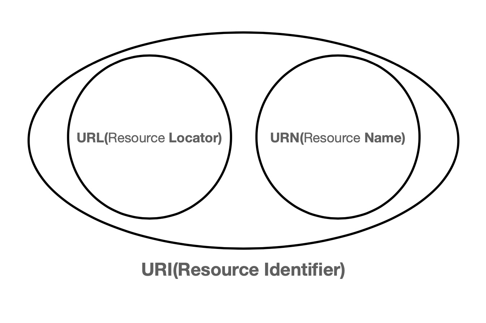
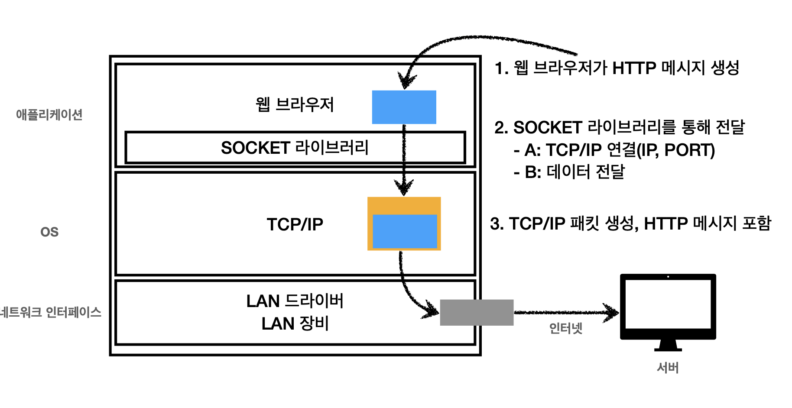

# URI와 웹 브라우저 요청 흐름

## URI

> Uniform Resource Identifier
>
> **U**niform : 리소스를 식별하는 통일된 방식
>
> **R**esource : 자원, URI로 식별할 수 있는 모든 것(제한 없음)
>
> **I**dentifier : 다른 항목과 구분하는데 필요한 정보

### URI vs URL vs URN

- URI : 리소스 식별
- URL : 리소스의 위치
- URN : 리소스의 이름
  - 위치는 변할 수 있지만, 이름은 변하지 않는다
  - 이름만으로 실제 리소스를 찾을 수 있는 방법이 보편화 되지 않음

### 문법

~~~
scheme://[userinfo@]host[:port][/path][?query][#fragment]
https://www.google.com:443/search?q=hello&hl=ko
~~~

- 프로토콜(https)
  - 주로 프로토콜 사 (Ex http, https, ftp 등등)
  - http는 80포트, https는 443 포트를 주로 사용, 포트는 생략 가능
- 호스트명(www.google.com)
  - 도메인명 또는 IP 주소를 직접 사용가능
- 포트번호(443)
  - 접속 포트
  - 일반적으로 생략 가능
- 패스(/search)
  - 리소스 경로, 계층적 구조
- 쿼리 파리미터(q=hello&hl=ko)
  - key=value 형태
  - `?` 로 시작, `&` 로 추가 가능

## 웹 브라우저 요청 흐름

### HTTP 메시지 전송

