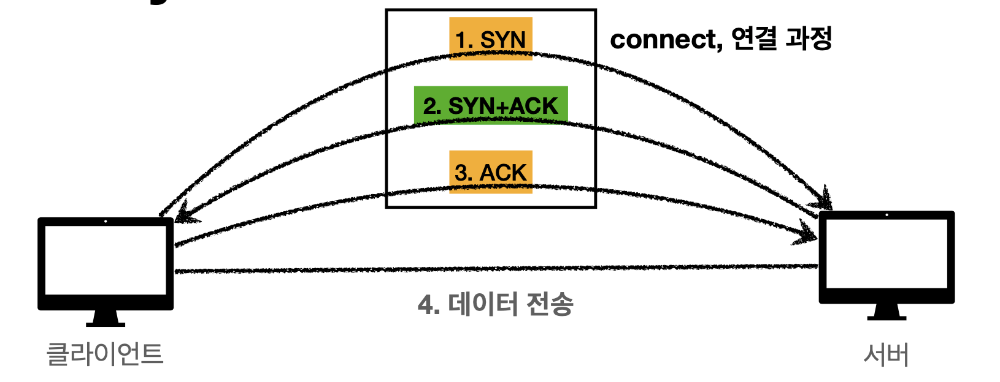

# 인터넷 네트워크

## IP 프로토콜의 한계

- 비연결성
  - 패킷을 받을 대상이 없거나 서비스 불능 상태여도 패킷 전송
- 비신뢰성
  - 중간에 패킷이 사라지면?
  - 패킷이 순서대로 안오면?
- 프로그램 구분
  - 같은 IP를 사용하는 서버에서 통신하는 애플리케이션이 둘 이상이면?

▶️ TCP로 해결

## TCP

> 전송 제어 프로토콜 (Transmission Control Protocol)

### 특징

- 연결 지향- TCP 3 way handshake (가상 연결)

  - 
  - 3번째 ACK 과정에서 데이터를 보내기도 함

- 데이터 전달 보증

  - 데이터를 보냈을때 응답이 온다

- 순서 보장

  - 패킷의 순서를 확인하여 잘못된것을 체크하고, 데이터를 다시 요청

    > 어떻게 순서를 확인할 수 있는지?
    >
    > 패킷을 보낼때 TCP 데이터 정보에 순서, 검증 정보가 추가로 가짐

- 신뢰할 수 있는 프로토콜

- 현재는 대부분 TCP 사용

## UDP

> 사용자 데이터그램 프로토콜 (User Datagram Protocol)

### 특징

- 하얀 도화지에 비유(기능이 거의 없음)
- 연결 지향 - TCP 3 way handshake X
- 데이터 전달 보증 X
- 순서 보장 X
- 데이터 전달 및 순서가 보장되지 않지만, 단순하고 빠름
- IP와 거의같다. <u>+PORT, +체크섬</u> 정도만 추가
- 애플리케이션에서 추가 작업 필요

## PORT

하나의 클라이언트와 여러개의 클라이언트와 통신해야한다면? 어떻게 구분하나? 

 ▶️  PORT

- IP와 PORT 구분

IP - 목적지를 구분 (Ex 아파트)

PORT - 애플리케이션을 구분 (Ex 동, 호수)

## DNS

> 도메인 네임 시스템 (Domain Name System)

IP는 기억하기 어렵다, 변경될 수 있다

▶️  DNS

- 전화번호부
- 도메인 명을 IP 주소로 변환

