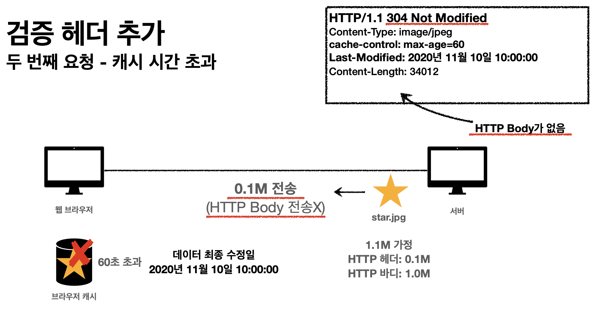
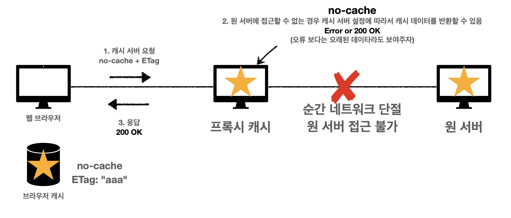

# 캐시와 조건부 요청

## 캐시 적용

- 캐시 덕분에 캐시 가능 시간동안 네트워크를 사용하지 않아도 된다.
- 비싼 네트워크 사용량을 줄일 수 있다
- 브라우저 로딩 속도가 매우 빠르다
- 빠른 사용자 경험

### 캐시 시간 초과

- 캐시 유효 시간이 초과되면, 서버를 통해 데이터를 다시 조회하고, 캐시를 갱신한다
- 이때 다시 네트워크 다운로드가 발생한다

> 이때, 똑같은 데이터를 조회하는거라면 리소스 낭비가 발생하게 된다.
>
> ► 이를 해결하기 위한 방법이 검증 헤더와 조건부 요청

## 검증 헤더와 조건부 요청

### 검증 헤더

- 캐시 데이터와 서버 데이터가 같은지 검증하는 데이터
- Last-Modified, ETag

### 조건부 요청 헤더

- If-Modifted-Since, If-Unmodified-Since : Last-Modified 사용
- If-Match, If-None-Match: ETag 사용
- 조건이 만족하면 200 OK
- 조건이 만족하지 않으면 304 Not Modified

#### Last-Modified

- 캐시 유효 시간이 초과해도, 서버의 데이터가 갱신되지 않으면
  - 
- 304 Not Modified<u>(검증 헤더)</u> + 헤더 메타 정보만 응답 **(바디X)**
  - 
- 클라이언트는 서버가 보낸 응답 헤더 정보로 캐시의 메타 정보를 갱신
  - 
- 클라이언트는 캐시에 저장되어 있는 데이터 재활용
- 결과적으로 네트워크 다운로드가 발생하지만 용량이 적은 <u>헤더 정보만 다운로드</u>
- 매우 실용적인 해결책

#### Last-Modifited, If-Modified-Since 단점

- 1초미만(0.x초) 단위로 캐시 조정이 불가능
- 날짜 기반의 로직 사용
- 데이터를 수정해서 날짜가 다르지만, 같은 데이터를 수정해서 데이터 결과가 똑같은 경우
  - A -> B -> A : 콘텐츠는 같으나, 서버 시간이 다르게 되어있을 경우
- 서버에서 별도의 캐시 로직을 관리하고 싶은 경우
  - 예) 스페이스나 주석처럼 크게 영향이 없는 변경에서 캐시를 유지하고 싶은 경우
  - `ETag` 로 관리할 수 있음

#### ETag, If-None-Match

- Tag(Entity Tag)
- 캐시용 데이터에 임의의 고유한 버전 이름을 달아둠
  - 예) ETag: "v1.0"
- 데이터가 변경되면 이 이름을 바꾸어서 변경함 (Hash를 다시 생성)
  - 예) ETag : "aaaa" -> "bbbb"
- 진짜 단순하게 ETag만 서버에 보내서 클라에서 같으면 유지, 다르면 다시 받기
- **캐시 제어 로직을 서버에서 완전히 관리**
- 클라이언트는 단순히 이 값을 서버에 재공(클라는 캐시 메커니즘을 모름)
- 예)
  - 서버는 베타 오픈 기간인 3일 동안 파일이 변경되어도 ETag를 동일하게 유지
  - 애플리케이션 배포 주기에 맞추어 ETag 모두 갱신

## 캐시 제어 헤더

### Cache-Control

> 캐시 지시어

- **Cache-Control : max-age**
  - 캐시 유효시간, 초 단위
- **Cache-Control : no-cache**
  - 데이터는 캐시해도 되지만, **항상 원(origin) 서버에 검증하고 사용**
- **Cache-Control : no-store**
  - 데이터에 민감한 정보가 있으므로 저장하면 안됨
    (메모리에서 사용하고 최대한 빨리 삭제)

### Pragma

- Pragma: no-cache
- HTTP 1.0 하위 호환

### Expires

- 캐시 만료일을 정확한 날짜로 지정
- HTTP 1.0 부터 사용
- 지금은 더 연한 Cache-Control : max-age 권장
- Cache-Control : max-age와 함께 사용하면 Expires는 무시

## 프록시 캐시

> Private 캐시 : 웹 브라우저나 로컬에 저장 

- **Cache-Control : public**
  - 응답이 public 캐시에 저장되어도 됨
- **Cache-Control: private**
  - 응답이 해당 사용자만을 위한 것임, private 캐시에 저장해야 함 (기본값)
- **Cache-Control: s-maxage**
  - 프록시 캐시에만 적용되는 max-age
- **Age: 60** (HTTP 헤더)
  - 오리진 서버에서 응답 후 프록시 캐시 내에 머문 시간(초)

## 캐시 무효화

- **Cache-Control : no-cache, no-stroe, must-revalidate**
  - Must-revalidate
    - 캐시 만료후 최초 조회시 **원 서버에 검증**해야함
    - 원 서버 접근 실패시 반드시 오류가 발생해야함 - 504(Gateway Timeout)
    - must-revalidate는 캐시 유효 시간이라면 캐시를 사용함
- **Pragma: no-cache**

### no-cache vs must-revalidate

- No-cache

  - 기본 동작

    

  - 네트워크 단절시
    

  > 네트워크 단절시, 원서버의 검정없이 <u>응답이 200</u>으로 내려온다

- must-revalidate

  - 

  > 네트워크 단덜시, <u>응답이 504</u>로 내려온다

