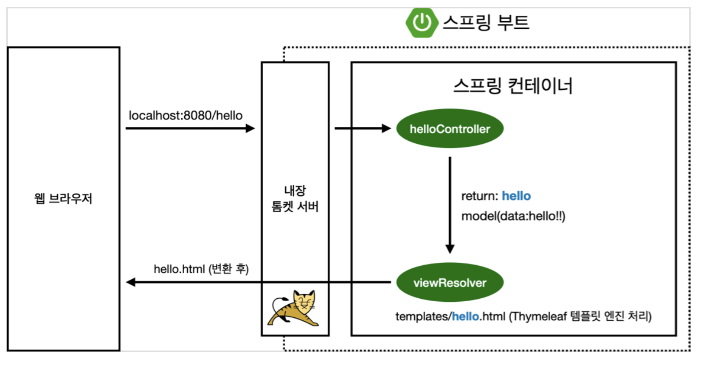

# Thymeleaf

> 템플릿 엔진

## thymeleaf 동작 확인

> 컨트롤러에서 리턴 값으로 문자를 반환하면 뷰 리졸버 (` viewResolver`) 가 화면을 찾아서 처리
>
> - 스프링 부트 템플릿 엔진 기본 viewName 매핑

### - 예시 코드

~~~java
// controller
package hello.hellospring.controller;

import org.springframework.stereotype.Controller;
import org.springframework.ui.Model;
import org.springframework.web.bind.annotation.GetMapping;

@Controller
public class HelloController {

    @GetMapping("hello")
    public String hello(Model model){
        model.addAttribute("data", "hello");
        return "hello"; // resources/templates에서 "hello"에 일치하는 html파일을 찾는다
    }
}
~~~

~~~html
<!-- template -->
<!DOCTYPE HTML>
<html xmlns:th="http://www.thymeleaf.org"> <head>
    <title>Hello</title>
    <meta http-equiv="Content-Type" content="text/html; charset=UTF-8" /> </head>
<body>

안녕하세요. 손님

</body>
</html>
~~~

> ​	`controller` 에서 보낸 model 을 `template` {} 로 받는다  
