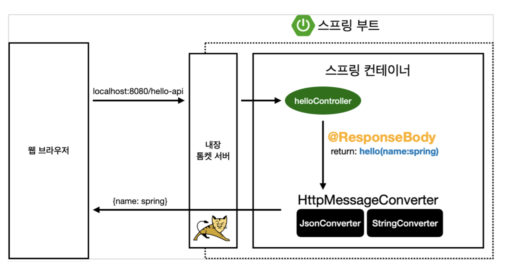

# 스프링 웹 개발 기초

## 정적 컨텐츠

> 파일을 그대로 웹 브라우저에 전송, controller 사용 X

### 예제

- 파일 저장 경로 - `resoucre/static/파일이름.html`

- 브라우저 접속시 - `localhost:8080/파일이름.html`

## MVC와 템플릿 엔진

> 서버에서 html을 변경하여 화면을 동적으로 만듬
>
> - 템플릿 엔진 : 서버에서 프로그래밍해서 html 파일을 동적으로 만들어줌
>
>   ex) jsp, php

### 예제

~~~java
// in controller
@GetMapping("hello-mvc")
    public String helloMvc(@RequestParam(value = "name", required = false)String name, Model model){
        model.addAttribute("name", name);
        return "hello-template";
}
~~~

- 실행 - localhost:8080/hello-mvc?name=spring

## API

### 동작 원리

> - `@ResponseBody` 사용
>
> HTTP의 BODY에 문제 내용을 직접 반환
>
> `viewResolver` 대신 `HttpMessageConverter` 동작
>
> - ``HttpMessageConverter`
>
>   - 문자 처리 : StringConvert
>
>   - 객체 처리 : MappingJackson2HttpMessageConverter (표준) or Gson
>
>     객체가 오면 기본 json 형태로 응답

### 예제

~~~java
		@GetMapping("hello-string")
    @ResponseBody // http의 body에 데이터를 직접 넣어준다
    public String helloString(@RequestParam(value = "name")String name){
        return "hello "+name; // html이 아닌 text형태
    }

    @GetMapping("hello-api")
    @ResponseBody // http의 body에 데이터를 직접 넣어준다
    public Hello helloApi(@RequestParam(value = "name")String name){
        Hello hello = new Hello();
        hello.setName(name);
        return hello; // html이 아닌 object(json) 형태
    }

    static class Hello{
        private String name;

        public String getName() {
            return name;
        }

        public void setName(String name) {
            this.name = name;
        }
    }
~~~

