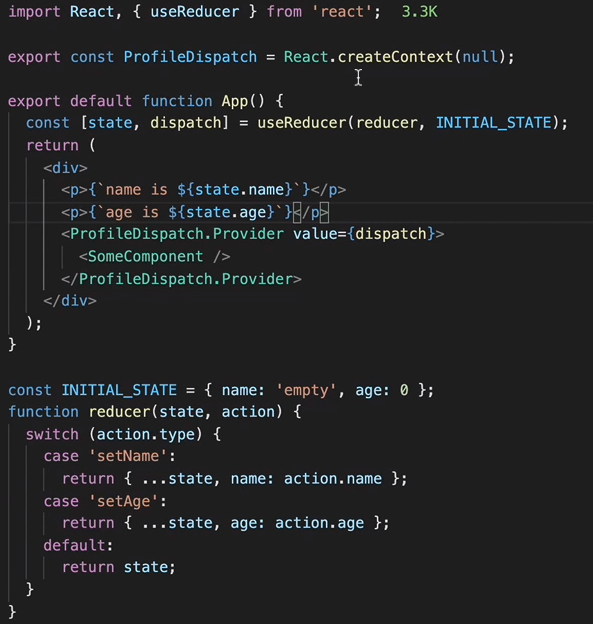

## State Hook

> 클래스 컴포넌트를 작성하지 않아도 함수에서 state와 같은 특징들을 사용가능

- 언제 사용하는지?

  > 함수 컴포넌트에서 state를 추가하고 싶을 때

  - function 과 class 같음

  ~~~jsx
  fuction Example(){
      const [count, setCount] = useState(0);
  }
  ~~~

  ~~~jsx
  class Example extends React.Component{
      constructor(props){
          super(props);
          this.state = {
              count: 0
          }
      }
  }
  ~~~

- 값 가져올때

  > 지정한 변수로 state값 가져옴

  ~~~html
  <h1> {count} </h1> <!--function -->
  <h1> {this.state.count} </h1> <!--class -->
  ~~~

- 갱신

  ~~~html
  <button onClick={() => setCount(count +1)} > 버튼 </button> <!--function -->
  <button onClick={() => this.setState({count: this.state.count +1})}> 버튼 </button> <!--class -->
  ~~~

### useState : state 관리

> 비동기 + 배치로 처리 
>
> - why? : 동기로 처리하면 값을 변경할때마다 리렌더링 되기때문에 성능 이슈가 발생할 수 있음

- 인자 : 초기값 지정

- 반환 : state 변수, 해당 변수를 갱신할 수 있는 함수 두가지 반환

- 비동기로 값 변경

  ~~~jsx
  // Wrong
  setCount(count+1);
  setCount(count+1);
  ~~~

  > setCount를 두번실행해서 값이 2로 증가할것이라고 예상
  >
  > But, 1개만 증가한다

  ~~~js
  // Correct
  setCount( v => v+1 );
  setCount( v => v+1 );
  ~~~

  > 값이 2 증가

- 여러개의 변수 처리

  ~~~js
  const [state, setState ] = useState({name:’’, age:0 })
  
  function Temp() {
      setState({...state, name: e.target.value }) 
  }
  ~~~

  > `useReducer` 로 이용하면 간편하다

- Array에 값 추가

  >... (전개법) 사용해서 기존의 값에서 새로운 값 추가

  ~~~js
  const [list, setList] = useState([]); // 빈 배열을 하나 생성
  
  function Add = () => {
  	const input = ‘hello’
  	setList([...list, input]) // 기존 배열에 있는 값 + 새로운 값 저장
  }
  ~~~

- 객체 상태값 변경

  ~~~jsx
  // Wrong
  const Counter() {
      const [count, setCount] = useState({value1:0},{value2:0},{value3:0});
  
  	function onClick() {
      	count.value1 += 1;
      	setCount(count);
  	}
      
      return (
          <>
          	<Title title = {count.value1}>
          </>
      )
  }
  ~~~

  > React에서 객체의 한부분만 수정하고 set에 넣으면 수정이 안되어있다고 판단되어 
  > 자식 컴포넌트에게 변경된 값이 넘어가지 않는다

  ~~~jsx
  // Correct
  const Counter() {
      const [count, setCount] = useState({value1:0},{value2:0},{value3:0});
  
  	function onClick() {
      	setCount({...count, value1 : count.value1+1})
  	}
      
      return (
          <>
          	<Title title = {count.value1}>
          </>
      )
  }
  ~~~

  > ... (전개법) 을 이용

## Effect Hook

### useEffect : lifecycle 관리

> 컴포넌트가 렌더링 이후에 어떤 일을 수행해야하는지 말함

~~~jsx
function Example(){
    const [count, setCount] = useState(0);
    
    useEffect( () => {
       document.title = 'You clicekd ${count} times'; 
    });
}
~~~

- 부수효과 함수 : 컴포넌트가 렌더링 된 후에 호출
  렌더링 결과가 실제 돔에 반영, 비동기로 호출
- 의존성 배열 : 배열의 값이 변경될때만 부수효과 함수를 실행
  - 어떤값을 입력해야하는지
    부수효과 함수에서 사용할 값 - 컴포넌트 상태값, 속성값, 컴포넌트 내부에 정의된 state, 지역변수
- useEffect 내에 새로운 부수함수
  - 다음 부수효과 함수가 호출되기 직전에 호출
  - 컴포넌트가 사라지기 직전에 (unmount) 마지막으로 호출

## useReducer

> 여러 state의 값을 한번에 관리

~~~jsx
function reducer(state, action){
  return{
    ...state,
    [action.name] : action.value
  };
}

onst Login = ({ onLogin }) => {
  const [state, dispatch] = useReducer(reducer, {
    id: '',
    pw: ''
  })

  const {id, pw} = state;
  
    //  ....
    
  const myChangeHandler = (e) => {
    dispatch(e.target)
  };
}
~~~

### useContext + useReducer

> useReducer를 통해 state의 상태를 변경하고,
>
> useContext를 통해 접근, 수정하면 괜찮은 state 를 관리할 수 있다

## useMemo

> 함수의 return 값을 저장, 변수가 변하지않앗다면 이전의 값 재사용

## useCallBack

> useMemo와 유사
>
> 함수 재사용
>
> ==> 렌더링 성능을 최적화해야 하는 상황에서 사용

## useContext

> 기존에서 ContextAPI를 사용할때는 render 안에서만 사용가능했는데
>
> useContext를 사용하면 함수내에서도 사용가능

~~~jsx
function Greeting(){
    const username = useContext(UserContext);
    return (
         
 {`${username}님 안녕하세요`} 

        
    )
}
~~~

### 하위컴포넌트에서 value 수정

~~~jsx
// Parent
const UserContext = createContext({ username: 'unknown', helloCount:0 })
const SetUserContext = createContext(() => {});

export default function App() {
    const [user, setUser] = useState({ username: 'mike', helloCount:0 })
    return (
        <>
        <SetUserContext.Provider value = {setUser}> // 객체로 넘겨야 불필요한 렌더링이 안생긴다
													// 값으로 넘기면 새로운 화면이 렌더링
            <UserContext.Provider value = {user}>
            	<Profile />
        	</UserContext.Provider>
        </SetUserContext>
        
        </>
    )
} 

// child
function Greeting () {
    const setUser = useContext(SetUserContext);
    const {username} = useContext(UserContext);
    return (
        <React.Fragment> 
            
 {`${username}님 안녕하세요`} 

            <button onClick = {() => setUser({username, helloCount: helloCount+1})}> 인사하기 </button>
        </React.Fragment>
    )
}
~~~

## useRef

> 직접 DOM 접근
>
> 일반적인 컴포넌트에도 접근이 가능
>
> 렌더링과 상관없는 값을 저장할때 유용 

~~~jsx
export default function App () {
    const inputRef = useRef();
    useEffect( () => {
        inputRef.current.focus(); // input에 포커스
    }, []);
    
    return (
        

            <input type="text" ref = {inputRef} />
            
        

    )
}
~~~

### 컴포넌트의 ref

- 클래스 컴포넌트 -> 인스턴스를 가르킴
  currenct를 통해 해당 클래스의 메서드를 호출
- 함수형 컴포넌트 
  -> `useImperativeHandle` 을 이용하여 인스턴스에 접근 가능 or props로 전달

## useLayoutEffect 

> `useEffect` 와 유사 
>
> useEffect는 부수효과 함수를 동기로 호출
>
> useLayoutEffect는 비동기로 호출 -> 렌더링 결과가 돔에 반영된 직후에 바로 호출

## Hook 의 장점

1. 재사용성
   컴포넌트를 함수로 관리하게 됨으로써 생기는 장점
   기존의 클래스의 라이프사이클과 state의 로직을 분리 -> 관리하기 편하다 (단위 테스트및 디버깅)

   다른 컴포넌트에서 쉽게 가져와서 쓸수 있음

## 에러 유형

### react-hooks 에러

- 에러 내용

~~~
React Hook "useState" is called in function "utilTest" which is neither a React function component or a custom React Hook function
~~~

- 에러 원인

컴포넌트를 만들 때, 맨앞을 `소문자` 로 시작해서 생긴 문제

소문자로 시작하면 JSX에서 HTML 요소로 간주하기 때문에 생긴 에러

- 해결 방법

~~~jsx
const UtilTest = () => {
    return (
        // 컴포넌트 내용
    );

}
~~~

